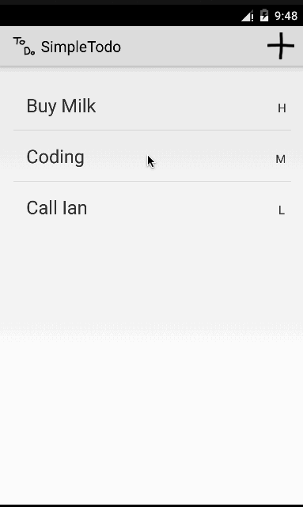

# Simple Todo App Demo
This is an Android pre-work Todo appication demo. See the <a href="http://example.com/">Android Pre-work:Todo App</a> for a step-by-step tutorial.

Complete pre-work stories:
- [x] Required: Setup your Android environment
- [x] Required: Build initial todo app
- [x] Required: Add edit functionality to todo app
- [x] Required: Submit todo app for review via Github
- [x] Required: Extend your todo app, improve UI, add features(Add Splash screen, customized icon, Persist the todo items into SQLite instead of a text file, Improve style of the todo items in the list using a custom adapter, Add support for completion due dates for todo items (and display within listview item), Add support for selecting the priority of each todo item (and display in listview item))

Walkthrough of all user stories:

GIF created with LiceCap.

